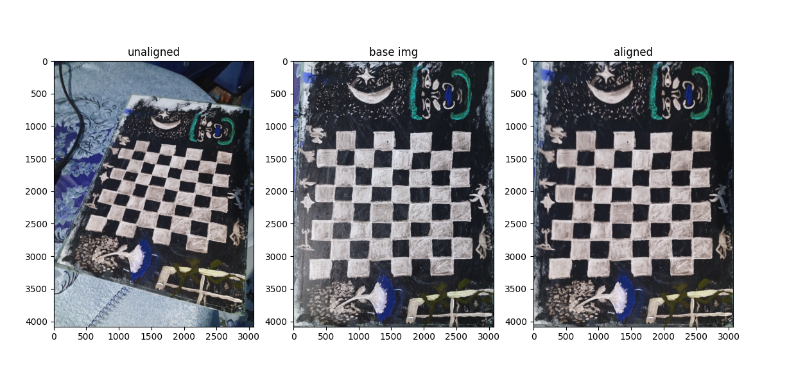

# Image-alignment--PYTHON-EDITION
Alignment of an unaligned image with a base/reference image using feature detection, feature matching, and homography in OpenCV.

## Features
- Detects keypoints and descriptors using **ORB** (can be swapped with AKAZE or SIFT for higher accuracy).
- Matches features with **Brute Force Hamming** matcher.
- Filters matches to keep only the best ones.
- Computes a **homography matrix** to warp the unaligned image into alignment with the base image.
- Optionally saves the aligned result to a file.
- Displays side-by-side comparison of the unaligned, base, and aligned images.

---

## Example Output
 
---

## How It Works
1. **Read the images** — Load both base and unaligned images.
2. **Resize** — Ensure both images have the same dimensions.
3. **Feature Detection** — Use ORB to detect keypoints and compute descriptors.
4. **Feature Matching** — Match descriptors between the two images.
5. **Filter Matches** — Keep the top matches (default: best 10%).
6. **Compute Homography** — Estimate the perspective transformation between matched points.
7. **Warp Image** — Apply the transformation to align the unaligned image with the base.

---

*Developed by Mohammed Yasser Mohammed* 
*call me ;)*

*email : es-mohamed.yasser2027@alexu.edu.eg* 
